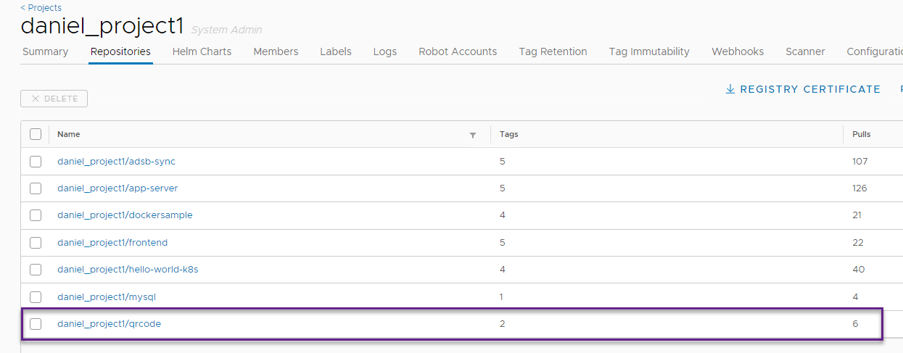
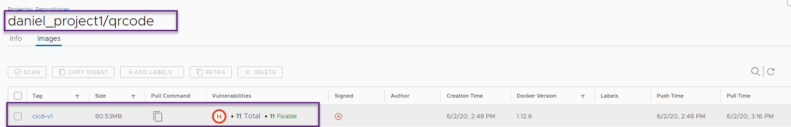
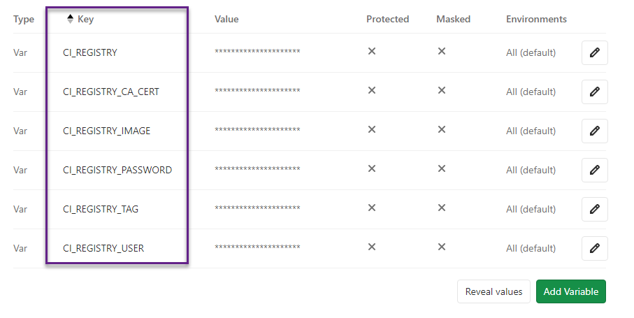
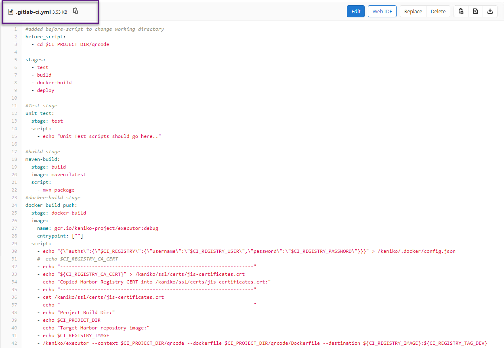
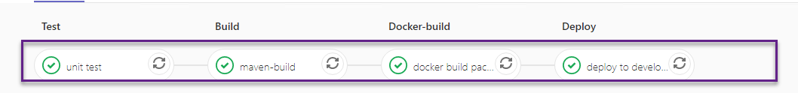
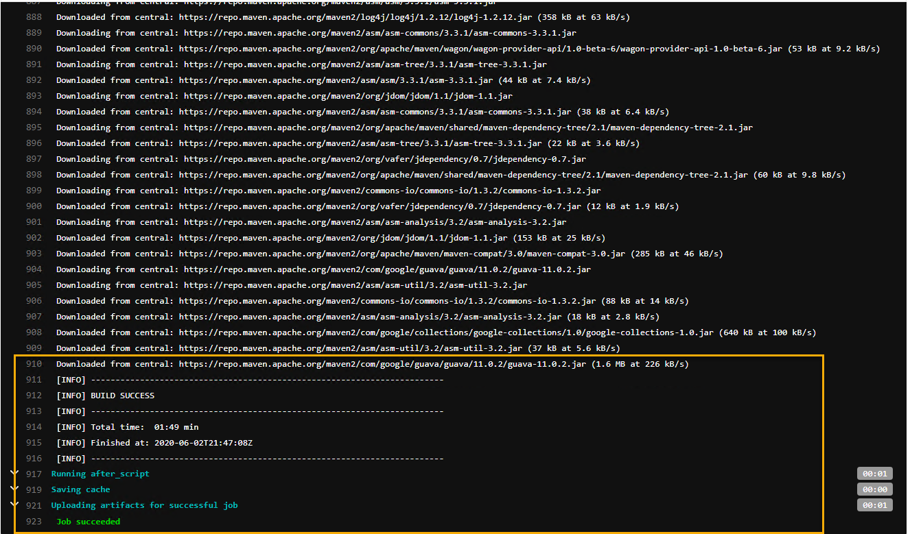
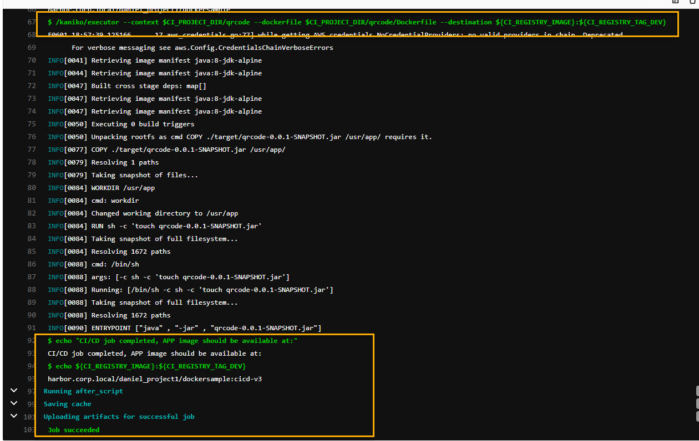
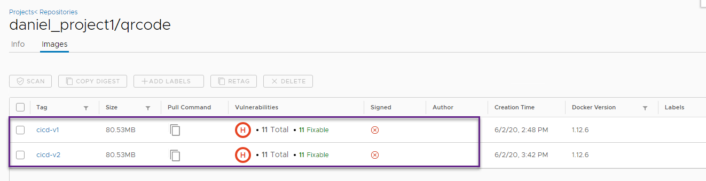
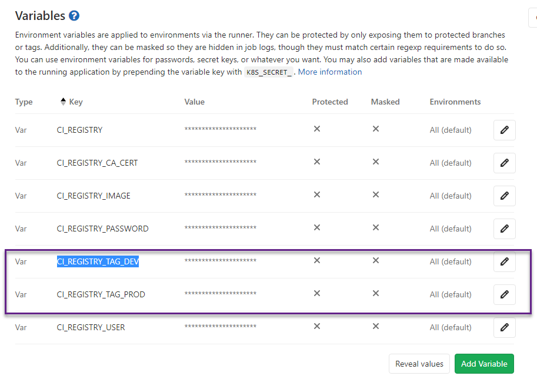
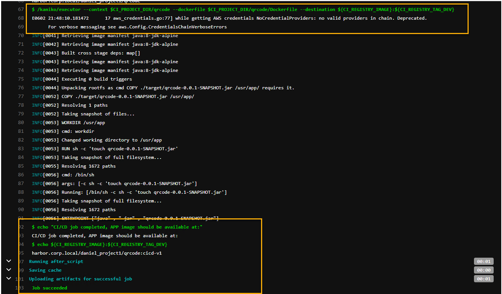

Table of Contents

[1. Introduction 3](#introduction)

[2. Pre-requisites 3](#pre-requisites)

[3. Add Existing TKGI K8s Cluster to GitLab project
4](#add-existing-tkgi-k8s-cluster-to-gitlab-project)

[4. Install and configure GitLab Runner using Helm chart, associate it
with project
8](#install-and-configure-gitlab-runner-using-helm-chart-associate-it-with-project)

[5. Configure and Execute CI/CD Pipeline for Building, Tagging and
Publishing Application Image into Harbor Registry 14](#_Toc42176726)


[6. Configure and Execute CI/CD Pipeline for Deployment of Application
from Registry to K8s Cluster
21](#configure-and-execute-cicd-pipeline-for-deployment-of-application-from-registry-to-k8s-cluster)

[7. Conclusion 29](#conclusion)

Introduction
------------

In this document, we provide an overview of integration of OmniBus
GitLab (Enterprise Edition) software change management (SCM) platform
with VMware Tanzu Kubernetes Grid Integrated (TKGI, formerly known as
VMware Enterprise PKS) Kubernetes clusters and Harbor container image
registry platform for automated software build tasks. GitLab is a
popular DevOps platform since it is compatible with Git file versioning,
project directory structure and client software.

We highlight configuration steps to enable integration between GitLab EE
and Kubernetes clusters provisioned with TKGI platform and Harbor
container image registry to enable CI/CD process automation using GitLab
tools.

Pre-requisites
--------------

-   The following software should be installed and accessible from

    -   VMware TKGI (formerly 'Enterprise PKS', v 1.6.1 or 1.7)

    -   Kubernetes cluster provisioned via TKGI environment that is
        accessible via kubectl CLI

    -   OmniBus GitLab Enterprise Edition (v 11.2 or later, v 12.10.5-ee
        used in a Lab for this paper) installed and configured,
        accessible via URL like https://gitlab.corp.local via
        administrator level account

        -   A GitLab project that contains software artifacts that can
            be built into container images. We are using the following
            example from GitHub:
            <https://github.com/riazvm/dockersample> cloned into a local
            GitLab project

    -   "CLI VM" -- typically a Linux VM that is used for Command Line
        access to Kubernetes clusters and runs other tools (Docker, Helm
        etc.) for configuration of integrations and intermediate
        validation of build process stages.

-   There should be no networking issues (firewalls, blocked ports, DNS
    resolution etc.) between GitLab VM, TKGI K8s clusters and Harbor VM

-   Main GitLab URL (such as **gitlab.corp.local**) should have a valid
    CA certificate (typically generated by GitLab installer script such
    as shown below:


Add Existing TKGI K8s Cluster to GitLab project
-----------------------------------------------

We need to add K8s cluster to our GitLab project as a target for CI/CD
deployments of containerized applications and for deploying Runner
components that execute pipeline tasks/scripts. See GitLab
[documentation](https://docs.gitlab.com/ee/ci/runners/README.html) for
more information on Runners

-   Start with "Add Existing Cluster" Tab in the "Operations --
    Kubernetes" menu for a project:

> Specify name and FDQN (create DNS record if doesn't exist yet) based
> URL of API Server/Master node(s)


-   Follow "More Information" links for each field to be filled in, as
    specified in documentation
    <https://gitlab.acelab.local/help/user/project/clusters/add_remove_clusters.md#add-existing-cluster>
    with the following fields:

Obtain CA certificate from the K8s cluster using command like

kubectl get secret \<secret name\> -o jsonpath =
\"{\[\'data\'\]\[\'ca\\.crt\'\]}\" \| base64 --decode

E.G. kubectl get secret \<default-token-p6br2\> -o jsonpath=
\"{\[\'data\'\]\[\'ca\\.crt\'\]}\" \| base64 -d

**Note:** If the command returns the entire certificate chain, copy the
*root ca* certificate value at the bottom of the chain:

\-\-\-\--*BEGIN CERTIFICATE\-\-\-\--*

*MIIC+zCCAeOgAwIBAgIUBEYdVQpHO7z4r608A+8wNRLmhbkwDQYJKoZIhvcNAQEL*

*BQAwDTELMAkGA1UEAxMCY2EwHhcNMjAwNDIyMDQ1NDM1WhcNMjQwNDIyMDQ1NDM1*

*WjANMQswCQYDVQQDEwJjYTCCASIwDQYJKoZIhvcNAQEBBQADggEPADCCAQoCggEB*

*...........................................................................................................................................*

*...........................................................................................................................................*

*C8h+Hip2IxlN/Kubq7Hv3yNFD9MbtnpCRmP9nFCo/UFapjljvtd6O0F1qPOQzU8=*

*\-\-\-\--END CERTIFICATE\-\-\-\--*

Copy the above certificate string value for use in the following steps

-   Obtain Authentication Token for GitLab authentication against K8s

> GitLab authenticates against K8s using service tokens, which are
> scoped to a namespace. The token used should belong to a service
> account with 'cluster-admin' privileges.
>
> Follow GitLab
> [documentation](https://gitlab.acelab.local/help/user/project/clusters/add_remove_clusters.md#add-existing-cluster)
> to create a Service Account and Cluster Role Binding with
> "cluster-admin" privileges using sample
> *gitlab-admin-service-account.yaml* K8s deployment descriptor provided
> as an example:
>
```yaml
> apiVersion: v1
>
> kind: ServiceAccount
>
> metadata:
>
> name: gitlab-admin
>
> namespace: kube-system
>
> \-\--
>
> apiVersion: rbac.authorization.k8s.io/v1beta1
>
> kind: ClusterRoleBinding
>
> metadata:
>
> name: gitlab-admin
>
> roleRef:
>
> apiGroup: rbac.authorization.k8s.io
>
> kind: ClusterRole
>
> name: cluster-admin
>
> subjects:
>
> \- kind: ServiceAccount
>
> name: gitlab-admin
>
> namespace: kube-system
```

Create Service account and Cluster Role Binding in the target cluster:

> kubectl apply -f gitlab-admin-service-account.yaml

*serviceaccount/gitlab-admin created*

*clusterrolebinding.rbac.authorization.k8s.io/gitlab-admin created*

-   **Retrieve token for the *gitlab-admin* Service Account:**

kubectl -n kube-system describe secret \$(kubectl -n kube-system get
secret \| grep gitlab-admin \| awk \'{print \$1}\')

*Name: gitlab-admin-token-rf6fr*

> *Namespace: kube-system*
>
> *Labels: \<none\>*
>
> *Annotations: kubernetes.io/service-account.name: gitlab-admin*
>
> *kubernetes.io/service-account.uid:
> dd65123d-1a2c-47e7-8a5e-97adf871c27d*
>
> *Type: kubernetes.io/service-account-token*
>
> *Data*
>
> *====*
>
> *ca.crt: 1094 bytes*
>
> *namespace: 11 bytes*
>
> ***token: \< authentication-token\>***

Paste value of ***authentication-token*** into the 'Service-Token' filed
in the "Add Existing Cluster" GitLab screen:


-   **Click "Add Cluster" button -- should get a confirmation of
    successful update on GitLab UI**:

> 

NOTE: in case if a warning about blocked requests to local networks is
displayed (when GitLab VM and K8s cluster API addresses are on the same
network), we may need to explicitly allow requests to local networks
from Web Hooks and Services from GitLab Admin UI, following KB Article:
<https://gitlab.com/gitlab-org/gitlab-foss/-/issues/57948>

> 

Install and configure GitLab Runner using Helm chart, associate it with project
-------------------------------------------------------------------------------

In GitLab CI/CD, Runners run the code defined in the .**gitlab-ci.yml**
pipeline definition file. They can be dedicated virtual machines or
dedicated Kubernetes Pods that pick up build jobs through the
coordinator API of GitLab CI/CD. A Runner can be specific to a certain
project or serve any project in GitLab CI/CD, the latter is called a
Shared Runner.

Below are the steps to prepare for installation of GitLab Runners as
in-cluster K8s resource via Helm chart, performed on CLI VM.(generally,
follows the documentation
<https://docs.gitlab.com/runner/install/kubernetes.html>)

-   Install Helm client/server following
    [documentation](https://helm.sh/docs/intro/install/) , validate that
    it can reach general repositories containing **gitlab-runner**
    charts

> **E.G.** helm search hub gitlab-runner
>
> *URL CHART VERSION APP VERSION DESCRIPTION*
>
> *https://hub.helm.sh/charts/choerodon/gitlab-runner 0.2.4 0.2.4
> gitlab-runner for Choerodon*
>
> *https://hub.helm.sh/charts/pnnl-miscscripts/git\... 0.1.3 0.1.2-1 A
> Helm chart for Kubernetes*
>
> *https://hub.helm.sh/charts/camptocamp/gitlab-ru\... 0.12.6 12.6.0
> GitLab Runner*
>
> ***https://hub.helm.sh/charts/gitlab/gitlab-runner 0.16.0 12.10.1
> GitLab Runner***

-   Download Harbor Registry certificate from its UI

> Login to Harbor UI, navigate to the Project where plan to host built
> container images click on "Registry certificate" to download the
> certificate file:


-   Create namespace in the K8s cluster where GitLab Runner Pod will be
    running (e.g. 'gitlabrunner' or any other valid name)

> kubectl create ns gitlabrunner
>
> NOTE: Here the Runner namespace is called **gitlabrunner** but it can
> be other valid namespace name

Set that namespace as current context:

> kubectl config set-context \--current \--namespace=gitlabrunner

-   Navigate in GitLab UI to "Settings CI/CD Runners":

> 
>
> and copy values for GitLab URL and Runner Registration token from the
> screen above.

-   Use GitLab URL and registration token values obtained in the
    previous step in the **values.yaml** Helm chart configuration file
    (full example available for Runner Helm chart installation in the
    GitHub repository:
    <https://gitlab.com/gitlab-org/charts/gitlab-runner/-/blob/master/values.yaml>)

> \#\# GitLab Runner Image
>
> \#\#
>
> \#\# By default it\'s using gitlab/gitlab-runner:alpine-v{VERSION}
>
> \#\# where {VERSION} is taken from Chart.yaml from appVersion field
>
> \#\#
>
> \#\# ref: https://hub.docker.com/r/gitlab/gitlab-runner/tags/
>
> \#\#
>
> \#\#image: gitlab/gitlab-runner:alpine-v11.6.0
>
> **gitlabUrl: https://gitlab.acelab.local**
>
> **runnerRegistrationToken: \'URHxzv5pFehqCKfxufQb\'**
>
> NOTE: please see GitLab documentation
> <https://docs.gitlab.com/runner/install/kubernetes.html> for
> recommended values of additional fields in values.yaml deployment
> configuration file for GitLab Runner Helm chart.

-   Another important field is RBAC support for a Runner service
    account. To have the chart create new Service account during
    installation, set **rbac.create** to **true**

> \#\# For RBAC support:
>
> **rbac:**
>
> **create: true**
>
> \#\# Define specific rbac permissions.
>
> \# resources: \[\"pods\", \"pods/exec\", \"secrets\"\]
>
> \# verbs: \[\"get\", \"list\", \"watch\", \"create\", \"patch\",
> \"delete\"\]
>
> ..
>
> (Otherwise, set to **rbac** **create** to **false** and specify
> existing Service Account)

-   An important setting is Max number of concurrent jobs to run which
    is controlled by **concurrent** filed value. Set it based on
    projected size of build jobs and related resource utilization:

> ..
>
> \#\# Configure the maximum number of concurrent jobs
>
> \#\# ref:
> https://docs.gitlab.com/runner/configuration/advanced-configuration.html\#the-global-section
>
> \#\#
>
> **concurrent: 10**
>
> **..**

-   To allow containers activated on Runner to make API calls against
    GitLab Secure API, we need to export SSL certificate from GitLab
    server in a CER (BASE 64) format into a file:

> 
>
> Notes:

-   The certificate file name used should be in the format
    **\<gitlab.hostname.domain.crt\>**, for example
    **gitlab.corp.local.crt**.

-   Any intermediate certificates need to be concatenated to your server
    certificate in the same file.

-   The hostname used should be the one the certificate is registered
    for.

```{=html}
<!-- -->
```
-   Generate K8s secret from GitLab CA certificate file (saved as
    **gitlab.corp.local.crt** in previous step) that complies with above
    conditions in the K8s namespace where Runner will be deployed using
    command like:

> \$ kubectl create secret generic gitlabca
> \--from-file=gitlab.corp.local.crt -n gitlabrunner
>
> *secret/gitlabca created*
>
> Validate that the secret got created:
>
> \$ kubectl get secrets
>
> *NAME TYPE DATA AGE*
>
> *default-token-ckt9m kubernetes.io/service-account-token 3 30m*
>
> *gitlabca Opaque 1 9s*

-   Use that K8 Secret name in the **certsSecretName** section of the
    **values.yaml** file as shown below:

> ..
>
> \#\# Set the certsSecretName in order to pass custom certificates for
> GitLab Runner to use
>
> \#\# Provide resource name for a Kubernetes Secret Object in the same
> namespace,
>
> \#\# this is used to populate the
> /home/gitlab-runner/.gitlab-runner/certs/ directory
>
> \#\# ref:
> https://docs.gitlab.com/runner/configuration/tls-self-signed.html\#supported-options-for-self-signed-certificates
>
> \#\# secret name
>
> **certsSecretName: gitlabca**

-   Configure environment variables that will be present when Runner
    registration command runs in the following section of values.yaml
    file:

\#\# This provides further control over the registration process and the
config.toml file

\#\# ref: \`gitlab-runner register \--help\`

\#\# ref:
https://docs.gitlab.com/runner/configuration/advanced-configuration.html

\#\#

envVars:

\- name: RUNNER\_ENV

value: \"DOCKER\_TLS\_CERTDIR=\"

\- name: **CI\_SERVER\_TLS\_CA\_FILE**

**value:
/home/gitlab-runner/.gitlab-runner/certs/gitlab.acelab.local.crt**

NOTE: certificate file name in the value for
**CI\_SERVER\_TLS\_CA\_FILE** variable should be same as file name used
to generate K8s secret above (**gitlabca)** used in the
***certsSecretName*** section

-   If CI/CD task will require using "executor" images running
    containers in 'privileged' mode (such as when using popular DIND
    "docker in docker", per GitLab
    [documentation](https://docs.gitlab.com/runner/executors/docker.html#use-docker-in-docker-with-privileged-mode)
    ), perform the following optional configuration steps:

> a\. Update "privileged" parameter flag in the **values.yaml** file:
>
> \#\# Run all containers with the privileged flag enabled
>
> \#\# This will allow the docker:dind image to run if you need to run
> Docker
>
> \#\# commands. Please read the docivi s before turning this on:
>
> \#\# ref:
> https://docs.gitlab.com/runner/executors/kubernetes.html\#using-docker-dind
>
> \#\#
>
> **privileged: true**
>
> **.....**
>
> b**.** Copy previously downloaded Harbor certificate file to
> **/etc/gitlab/trusted-certs** and **/etc/gitlab/ssl** folders of
> GitLab VM file system:
>
> ls /etc/gitlab/ssl
>
> **ca\_harbor.crt**
>
> gitlab.acelab.local.crt
>
> *....*
>
> ls /etc/gitlab/trusted-certs
>
> **ca\_harbor.crt**
>
> gitlab.acelab.local.crt
>
> c\. Target TKGI K8s cluster should be deployed with Pod Security
> Policies (PSP) set to "privileged" mode, per
> [documentation](https://docs.pivotal.io/pks/1-4/pod-security-policy.html)

NOTE: in our CI/CD example below we will be using an executor container
image based on Google Project Kaniko which **does not require running in
privileged mode**, please see GitLab
[documentation](https://docs.gitlab.com/ee/ci/docker/using_kaniko.html#requirements)
for details. **Therefore, the configuration steps in this section are
not required for running this example.**

-   Add a Helm repository containing the chart for Runner deployment:

> helm repo add stable
> <https://kubernetes-charts.storage.googleapis.com>
>
> Verify that repository has been added and is available:
>
> helm repo list
>
> *NAME URL*
>
> *gitlab https://charts.gitlab.io*
>
> ***stable https://kubernetes-charts.storage.googleapis.com***

-   Perform GitLab Runner installation using Helm chart, from the
    directory where **values.yaml** file is located:

> helm install gitlab-runner -f ./values.yaml gitlab/gitlab-runner -n
> gitlabrunner
>
> NOTES:

-   IMPORTANT: if running Helm command from another directory that
    doesn't contain **values.yaml** file, provide full path to that file
    to customize

-   'gitlab-runner' is the name of Runner chart deployment, chosen
    arbitrary

-   gitlab/gitlab-runner is the name of Helm chart from the repository

> An output of 'helm install' command should look like:
>
> *NAME: gitlab-runner*
>
> *LAST DEPLOYED: Sun May 3 05:46:50 2020*
>
> *NAMESPACE: gitlabrunner*
>
> *STATUS: deployed*
>
> *REVISION: 1*
>
> *TEST SUITE: None*
>
> *NOTES:*
>
> *Your GitLab Runner should now be registered against the GitLab
> instance reachable at: <https://gitlab.acelab.local>*

-   (Optional) validate that Runner deployment/pod are running in the
    designated K8s namespace:

kubectl get deploy, po -n gitlabrunner

> *NAME READY UP-TO-DATE AVAILABLE AGE*
>
> *deployment.apps/gitlab-runner-gitlab-runner 1/1 1 1 33s*
>
> *NAME READY STATUS RESTARTS AGE*
>
> *pod/gitlab-runner-gitlab-runner-74f7fc87cb-p699g 1/1 Running 0 33s*

-   Verify that newly installed Runner is configured for GitLab
    project(s):

> Navigate to **Settings CI/CD** **Runners** of the Project and check
> whether Runner shows as active (green color):
>
> 
>
> Notes:

-   Usually, Runner configured on a project level will show up in
    Settings CI/CD automatically, when deployed to integrated cluster.
    In other cases they may be additional steps needed to make Runner
    available for a GitLab project, per
    [documentation](https://docs.gitlab.com/ee/ci/runners/README.html#registering-a-specific-runner)

-   Same instance of Runner can be optionally shared among multiple
    projects, that can be configured in GitLab "CI/CD Settings Shared
    Runners", per
    [documentation](https://docs.gitlab.com/ee/ci/runners/README.html#registering-a-shared-runner)

Configure and Execute CI/CD Pipeline for Building, Tagging and Publishing Application Image into Harbor Registry
----------------------------------------------------------------------------------------------------------------

> We will start by building \"Continuous Integration\" part of our CI/CD
> pipeline. It compiles a simple SpringBoot based microservice from its
> Java source code using Maven, continues to build a container image
> using provided Dockerfile and pushes built/tagged image into
> designated project in the Harbor image repository.

-   Properties of target Harbor project (top level construct for images
    hosting) are shown below. It is not 'Public' and therefore requires
    authorized user login with at least "Developer" access level, per
    Harbor
    [documentation](https://goharbor.io/docs/1.10/administration/managing-users/).
    It has image vulnerability scanning on 'push': any time an image is
    added to a registry via 'docker push...' command, it will be scanned
    for vulnerabilities automatically.

> 

-   There are other image repositories configured for that project,
    shown below:

> 
>
> Our GitLab pipeline will be building and pushing images into
> '**daniel\_project1/qrcode'** repository that may contain previously
> uploaded images:
>
> 
>
> There is an existing version of an image with 'cicd-v1' tag

-   File structure of the example GitLab project called **dockersample**
    is shown below:


-   Add default CI/CD pipeline script file (.**gitlab-ci.yaml**) at the
    root level of the Project using "CI/CD Configuration" option

NOTE: .**gitlab-ci.yaml** CI/CD script syntax should comply with
structure and stages defined in accordance with documentation:
<https://docs.gitlab.com/ee/ci/yaml/README.html>

-   Edit contents of that script file from GitLab IDE (or outside of it
    and use Git client to commit changes to project repository):

> **NOTES:**

-   **.gitlab-ci.yaml** is a default CI/CD pipeline file name for any
    GitLab project, other pipelines can be invoked from it

-   Environment variables values referenced in pipeline scripts
    (CI\_REGISTRY, CI\_REGISTRY\_USER etc.) should be defned via
    "Settings CI/CD Variables" section of the project:

> 
>
> Scope of those variables should be normally set as 'Environment
> scope', additional options to protect their values (such as for
> passwords etc.) are available via GitLab settings.

-   For variables that contain values of SSL certificate, make sure it
    keeps its original format, as shown below:


> (reason being that pipeline script will basically automate commands
> like: "**docker login \${CI\_REGISTRY} -u \${CI\_REGISTRY\_USER} -p
> \${CI\_REGISTRY\_PASSWORD}"** to run as API call from CI/CD script)

-   To bypass a need for executor containers to have privileged access
    to Docker daemon to run "docker build" commands, we can use
    unprivileged access via [Google
    Kaniko](https://github.com/GoogleContainerTools/kaniko) execution
    environment: <https://docs.gitlab.com/ee/ci/> (OK for running
    builds, not for running container images) See details in:
    [https://docs.gitlab.com/ee/ci/docker/using\_kaniko.html](https://nam04.safelinks.protection.outlook.com/?url=https%3A%2F%2Fdocs.gitlab.com%2Fee%2Fci%2Fdocker%2Fusing_kaniko.html&data=02%7C01%7Cdzilberman%40vmware.com%7C62bf8cace2334bf13b7c08d7eacc40d0%7Cb39138ca3cee4b4aa4d6cd83d9dd62f0%7C0%7C0%7C637236035295994833&sdata=t9pqhqhr0RIA0f2nG5Jnwk2%2FGuLch0pNov9NAUajQBo%3D&reserved=0)

-   Edit default CI/CD pipeline script (.**gitlab-ci.yaml**) at the root
    of GitLab project directory:


-   Example of a working version of above script that builds and pushes
    Docker container image from GitLab project sub-folders is shown
    below:

> 
>
> NOTES:

-   Correctly formatted section of above **.gitlab-ci.yml** file can be
    found below:

> \#added before-script to change working directory
>
> before\_script:
>
> \- cd \$CI\_PROJECT\_DIR/qrcode
>
> stages:
>
> \- test
>
> \- build
>
> \- docker-build
>
> \- deploy
>
> \#Test stage
>
> unit test:
>
> stage: **test**
>
> script:
>
> \- echo \"Unit Test scripts should go here..\"
>
> \#build stage
>
> maven-build:
>
> stage: **build**
>
> image: maven:latest
>
> script:
>
> \- mvn package
>
> \#docker-build stage
>
> docker build push:
>
> stage: **docker-build**
>
> image:
>
> name: gcr.io/kaniko-project/executor:debug
>
> entrypoint: \[\"\"\]
>
> script:
>
> \- echo
> \"{\\\"auths\\\":{\\\"\$CI\_REGISTRY\\\":{\\\"username\\\":\\\"\$CI\_REGISTRY\_USER\\\",\\\"password\\\":\\\"\$CI\_REGISTRY\_PASSWORD\\\"}}}\"
> \> /kaniko/.docker/config.json
>
> \#- echo \$CI\_REGISTRY\_CA\_CERT
>
> \- echo
> \"\-\-\-\-\-\-\-\-\-\-\-\-\-\-\-\-\-\-\-\-\-\-\-\-\-\-\-\-\-\-\-\-\-\-\-\-\-\-\-\-\-\-\-\-\-\-\-\-\-\-\-\-\-\-\-\-\-\-\-\-\-\-\-\-\-\--\"
>
> \- echo \"\${CI\_REGISTRY\_CA\_CERT}\" \>
> /kaniko/ssl/certs/jis-certificates.crt
>
> \- echo \"Copied Harbor Registry CERT into
> /kaniko/ssl/certs/jis-certificates.crt:\"
>
> \- echo
> \"\-\-\-\-\-\-\-\-\-\-\-\-\-\-\-\-\-\-\-\-\-\-\-\-\-\-\-\-\-\-\-\-\-\-\-\-\-\-\-\-\-\-\-\-\-\-\-\-\-\-\-\-\-\-\-\-\-\-\-\-\-\-\-\-\-\--\"
>
> \- cat /kaniko/ssl/certs/jis-certificates.crt
>
> \- echo
> \"\-\-\-\-\-\-\-\-\-\-\-\-\-\-\-\-\-\-\-\-\-\-\-\-\-\-\-\-\-\-\-\-\-\-\-\-\-\-\-\-\-\-\-\-\-\-\-\-\-\-\-\-\-\-\-\-\-\-\-\-\-\-\-\-\-\--\"
>
> \- echo \"Project Build Dir:\"
>
> \- echo \$CI\_PROJECT\_DIR
>
> \- echo \"Target Harbor reposiory image:\"
>
> \- echo \$CI\_REGISTRY\_IMAGE
>
> \- /kaniko/executor \--context \$CI\_PROJECT\_DIR/qrcode \--dockerfile
> \$CI\_PROJECT\_DIR/qrcode/Dockerfile \--destination
> \${CI\_REGISTRY\_IMAGE}:\${CI\_REGISTRY\_TAG\_DEV}
>
> \- echo \"CI/CD job completed, APP image should be available at:\"
>
> \- echo \${CI\_REGISTRY\_IMAGE}:\${CI\_REGISTRY\_TAG\_DEV}
>
> environment:
>
> name: development
>
> \#build docker app only when a pipeline on master branch is run
>
> only:
>
> \- master
>
> NOTES:

-   This CI/CD script contains the following stages:

    -   **test** to perform app unit testing (not implemented fully)

    -   **build** to perform Maven build of SpringBoot service from Java
        source code

    -   **docker-build** to perform Docker build/tag/push operations to
        publish images to container registry

    -   **deploy** to perform deployment of containerized application
        from container registry to target K8s cluster (covered in detail
        in Section 6)

-   It is using **maven:latest** container image for **build** stage
    jobs execution .

-   Then **gcr.io/kaniko-project/executor:debug** container image used
    for **docker-build** stage jobs execution to build an image defined
    in Dockerfile and pushes it into registry defined by
    CI\_REGISTRY\_IMAGE environment variable with a tag defined in the
    CI\_REGISTRY\_TAG\_DEV

-   For now, we only want to deploy the application when pipeline on
    **master** branch is run hence the 'only -master' condition at the
    end of stage script

-   Pipeline execution progress and results (success/failure) for each
    stage can be monitored in real time as shown for build stage below:

> 
>
> and reviewed in detail during or after its completion via GitLab CI/CD
> UI, as shown below for **build** stage:
>
> 
>
> And for **docker-build** stage
>
> 

-   If Pipeline execution is successful, in the designated Harbor
    project/repository there should be a new container image(s) from
    GitLab project, tagged according to passed value of
    CI\_REGISTRY\_TAG\_DEV variable and scanned for vulnerabilities, per
    project settings:

> 

-   Notes:

    -   This part of pipeline essentially implements its "CI" use case
        by automating source code and docker container build and upload
        to a centralized image repository for further use in CD
        processes

    ```{=html}
    <!-- -->
    ```
    -   Other Examples of end-to-end Docker container build and
        deployment automation via GitLab CI/CD pipelines can be found in
        various blogs such as:
        https://sanderknape.com/2019/02/automated-deployments-kubernetes-gitlab/

    -   Operations teams that just need to run stabilized builds may use
        "Auto DevOps" GitLab mode or run additional pipelines defined
        via **.gitlab-ci.yaml** as in example above.

    -   If developers need to create their own customized pipelines,
        please see GitLab documentation:
        https://gitlab.acelab.local/help/ci/pipelines/settings\#custom-ci-configuration-path

Configure and Execute CI/CD Pipeline for Deployment of Application from Registry to K8s Cluster
-----------------------------------------------------------------------------------------------

> In this section we will continue building our end-to-end CI/CD
> pipeline stage that implements automated deployment of container
> images from Harbor registry (selected by tags) into TKGI K8s cluster
> integrated with our project, thus completing "Continuous Deployment"
> part of CI/CD.

-   Similar to how it was done in Section 3 (for deployment of GitLab
    Runner into the **daniel-lab2-small1-sharedt1** K8s cluster), we
    will integrate a K8s cluster **mgr-cluster-test2** for deployment of
    an application from our GitLab project. Below are properties of an
    integrated K8s cluster for our project, **dockersample**:

> 
>
> NOTE: Optional Project namespace property will map into K8s namespace
> that would be set as a target namespace for applications deployment.
> In our example, that namespace is "qrcode" and it will need to exist
> in the K8s cluster when application will be deployed by CI/CD pipeline

-   We will add 2 Kubernetes related files to our GitLab project
    repository:

    -   Deployment descriptor for GitLab Service Account used to create
        service account for integration with K8s cluster above
        (gitlab-service-account.yaml)

    -   Deployment descriptor for deployment of application containers
        into K8s cluster (deployment\_qrcode.yaml)

> 

-   Below is content of **deployment\_qrcode.yaml** file -- a pretty
    standard K8s Deployment descriptor that specifies image name, labels
    and number of replicas to be created in ReplicaSet as well as K8s
    secret with Harbor login credentials that would need to exist in the
    namespace where application will be deployed:

> \-\--
>
> apiVersion: apps/v1
>
> kind: Deployment
>
> metadata:
>
> name: qrcode-java
>
> \#namespace: hello-world
>
> labels:
>
> app: qrcode
>
> spec:
>
> replicas: 2
>
> selector:
>
> matchLabels:
>
> app: qrcode
>
> strategy:
>
> type: RollingUpdate
>
> rollingUpdate:
>
> maxSurge: 1
>
> maxUnavailable: 33%
>
> template:
>
> metadata:
>
> labels:
>
> app: qrcode
>
> spec:
>
> imagePullSecrets:
>
> \- name: regcred
>
> containers:
>
> \- name: qrcode
>
> \#NOTE: cicd-v3 tag is for deploymet branch, will have to use another
> one for production
>
> image: **harbor.corp.local/daniel\_project1/qrcode:cicd-v3**
>
> ports:
>
> \- containerPort: 8080
>
> NOTE: in this version, an image tagged as
> **harbor.corp.local/daniel\_project1/qrcode:cicd-v3** is expected to
> be present in the Harbor repository at the time of deployment to K8s
> (automated in the previous stages of CI/CD pipeline). That tag value
> is contained in the CA\_REGISTRY\_TAG\_DEV variable below
>
> 

-   Now we need to implement **deploy** stage of our CI/CD pipeline
    script (same .gitlab-ci.yaml file in our example) that will take
    care of establishing connection to target K8s cluster and performing
    all necessary steps to deploy our application using deployment
    descriptor above. For now, we only want to deploy the application
    only when pipeline on **master** branch is run hence the 'only ...'
    condition

> .....
>
> \#deploy stage
>
> deploy to development:
>
> stage: deploy
>
> image:
> \"**registry.gitlab.com/gitlab-org/cluster-integration/auto-deploy-image:v0.15.0**\"
>
> script:
>
> \- echo \"Runner in Environment:\"
>
> \- echo \$CI\_ENVIRONMENT\_SLUG
>
> \- echo \"WILL USE BUILT IN K8s VARS PER ENVIRONENT:\"
>
> \- echo \"KUBE\_URL:\"
>
> \- echo \$KUBE\_URL
>
> \- echo \"KUBE\_NAMESPACE:\"
>
> \- echo \$KUBE\_NAMESPACE
>
> \- echo \"Path to kubeconfig:\"
>
> \- echo \$KUBECONFIG
>
> \- echo \"=================================\"
>
> \- echo \"Trying to \'get nodes\' using default kubeconfig
> setting\...\"
>
> \# will use syntax like kubectl config \--kubeconfig=config-demo
> set-cluster
>
> \- kubectl \--kubeconfig=\"\${KUBECONFIG}\" get nodes
>
> \- echo \"=================================\"
>
> \- echo \"CHECK K8s current context set to:\"
>
> \- kubectl config current-context
>
> \- echo \"Getting Nodes info w/o using context:\"
>
> \- kubectl get nodes
>
> \#- echo
> \"\-\-\-\-\-\-\-\-\-\-\-\-\-\-\-\-\-\-\-\-\-\-\-\-\-\-\-\-\-\-\-\-\-\-\-\-\-\-\-\-\-\-\-\-\-\-\-\--\"
>
> \# TODO: add error handling in case if NS exists or just delete
> proactively
>
> \- kubectl delete ns \$KUBE\_NAMESPACE
>
> \- sleep 60
>
> \# now create it again
>
> \- kubectl create ns \$KUBE\_NAMESPACE
>
> \- echo \"Creating regcred Docker login secret \'regcred\'..\"
>
> \- kubectl create secret docker-registry regcred
> \--docker-server=\$CI\_REGISTRY
> \--docker-username=\$CI\_REGISTRY\_USER
> \--docker-password=\$CI\_REGISTRY\_PASSWORD
> \--docker-email=admin\_harbor\@acelcab.local
>
> \- kubectl get secrets
>
> \- echo \"Will deploy QR Code container app to target
> cluster/namespace:\"
>
> \- kubectl apply -f \$CI\_PROJECT\_DIR/deployment\_qrcode.yaml
>
> \- echo \"QR Code container App deployed to K8s cluster, checking Pod
> status:\"
>
> \- kubectl get deploy,po -n \$KUBE\_NAMESPACE
>
> \- kubectl expose deployment qrcode-java \--type=LoadBalancer
> \--name=qrcode-lb \--port=8090 \--target-port=8080 -n
> \$KUBE\_NAMESPACE
>
> \- echo \"QR Code App should be exposed via LoadBalancer IP on port
> 8090:\"
>
> \- kubectl get svc -n \$KUBE\_NAMESPACE
>
> environment:
>
> name: development
>
> \#deploy app to K8s only when a pipeline on master branch is run
>
> only:
>
> \- master
>
> NOTES:

-   We are using a different container image to run jobs for **deploy**
    stage,
    \"registry.gitlab.com/gitlab-org/cluster-integration/auto-deploy-image:v0.15.0\"
    that has kubectl CLI utility pre-installed

-   \$KUBE\_URL, \$KUBE\_TOKEN, \$KUBE\_NAMESPACE and \$KUBECONFIG are
    K8s environment variables that become available to CI/CD scripts
    once an **environment** is defined, as in the last 2 lines above
    (see details in documentation:
    <https://docs.gitlab.com/ee/user/project/clusters/#deploying-to-a-kubernetes-cluster>)

-   \$KUBECONFIG variable contains path to K8s configuration file placed
    on the 'builder' image that can be used by 'kubectl' CLI utility -
    pretty much the only parameter needed for access to target cluster

-   Namespace contained in the \$KUBE\_NAMESPACE needs to exist in the
    target K8s cluster, so it is first deleted by kubectl delete ns
    \$KUBE\_NAMESPACE to make sure there is no error and then getting
    created by kubectl create ns \$KUBE\_NAMESPACE command

-   A secret containing Harbor registry credentials for deployment of an
    image needs to exist in that namespace and gets created by kubectl
    create secret docker-registry regcred ... command.

-   Actual application deployment is done by running kubectl apply -f
    \$CI\_PROJECT\_DIR/deployment\_qrcode.yaml command that is using
    deployment descriptor above

-   'sleep' operators added to allow previous command to complete and
    avoid error of creating namespace before deletion is committed.

-   As mentioned above, current version of pipeline deploys the
    application into **development** environment only when pipeline on
    **master** branch is run

-   Multiple '- echo ' operators are placed into the script for
    debugging purposes and can be removed
	

- When our project CI/CD pipeline is executed end-to-end, it first
    runs a unit test stage (not implemented, has a placeholder), then
    rebuilds a Docker image from the source code and instructions
    contained in the Dockerfile, tags it with value
    \$CI\_REGISTRY\_TAG\_DEV and pushes it into corresponding repository
    in Harbor.

- An output of **docker build push** job section is shown below:

> 
>
> Script in the **deploy** job section performs deployment of tagged
> container image from Harbor registry according to deployment
> descriptor into designated namespace in the integrated K8s cluster:
>
> 
>
> Checking directly in the **mgr-cluster-test2** integrated K8s cluster,
> we can see 2 replicas of **qrcode-java** pod running, as expected:
>
> kubectl get deploy,po,svc -n qrcode
>
> NAME READY UP-TO-DATE AVAILABLE AGE
>
> **deployment.apps/qrcode-java** 2/2 2 2 128m
>
> NAME READY STATUS RESTARTS AGE
>
> pod/qrcode-java-7f77794b99-dd2hf 1/1 Running 0 128m
>
> pod/qrcode-java-7f77794b99-g8cr7 1/1 Running 0 128m
>
> NAME TYPE CLUSTER-IP EXTERNAL-IP PORT(S) AGE
>
> service/qrcode-lb LoadBalancer 10.100.200.71 **10.40.14.88**
> 8090:31877/TCP 128m

And finally, we can initiate a POST request with a form data and get a
QRcode binary file back:

> curl -d \'{\"merchantID\":\"123\", \"merchantName\":\"riaz\"}\' -H
> \"Content-Type: application/json\" -X POST
> [http://10.40.14.88:8090/generateQRCode \--output
> QRCode.out](http://10.40.14.88:8090/generateQRCode%20--output%20QRCode.out)
>
> \% Total % Received % Xferd Average Speed Time Time Time Current
>
> Dload Upload Total Spent Left Speed
>
> 100 312 100 267 100 45 2321 391 \--:\--:\-- \--:\--:\-- \--:\--:\--
> 2713


NOTES:

-   In addition to **development** environment, other environments (e.g.
    **staging**, **production etc.**) can be defined in the CI/CD script
    sections to direct deployments and contain different
    instructions/parameters (such as Docker image tags). That's the
    purpose of having CI\_REGISTRY\_TAG\_PROD variable. Please see
    documentation for using environments in CI/CD pipelines:
    https://docs.gitlab.com/ee/ci/pipelines/index.html

-   Actual unit testing script can be defined in the **test** stage.

-   As in our example, GitLab Runner containers that run scripts defined
    in pipelines and deployed Applications may run in different K8s
    clusters (in fact, that may be preferred). Those clusters just need
    to have networking/DNS access to each other as
    **daniel-lab2-small1-sharedt1** and **mgr-cluster-test2** do**.**

Conclusion
----------

> We hope this document was useful. As you try these configuration
> steps, please provide any feedback or questions in the comments
> section for this document on code.vmware.com. Also, please let us know
> if you have any suggestions or if you would like to see guidance on
> other topics.
